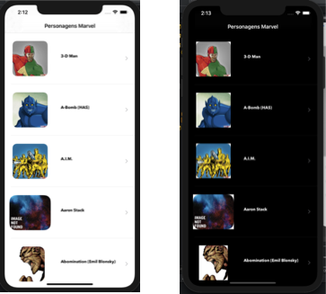

## Personagens Marvel

Personagens Marvel é uma aplicação que consome os dados da [API da Marvel Comics Book](https://developer.marvel.com) apresentando seus personagens, permitindo que o usuário visualize  detalhes e os HQs mais caros. 

## **Atividades do Projeto**

Utilizamos metodologia Ágil para o controle do projeto com as seguintes atividades:

**Setup**
-   Elaborar kaban
-   Elaborar Cronograma
-   Solution Design Document - Blue Print - readme.md
-   Registrar na [developer.marvel.com](http://developer.marvel.com)
-   Gerar chaves
-   Testar acesso à API validando as chaves Postman
-   Testar acesso à API validando as chaves Xcode
-   Instalar Arquitetura Clean Swift Templates no Xcode
-   Estruturar o Projeto na Arquitetura do Clean Swift

**Implementação**  

-   Desenhar Storyboard - com animação entre telas
-   Desenhar telas
-   Implementar Serviços API REST Marvel
-   Implementar Lista de Personagens - com paginação 20 itens por pagina  -  Exibir na lista nome e foto de cada personagem - Na seleção ir para a tela de Detalhes do Personagem
-   Implementar Testes Unitários Lista de Personagens
-   Implementar Detalhes do Personagem
-   Implementar Testes Unitários Detalhes do Personagens
-   Implementar HQ mais Cara
-   Implementar Testes Unitários HQ mais Cara.

## **Arquitetura da Aplicação**

Escolhemos o [Clean Swift](https://clean-swift.com/) como arquitetura para esta aplicação por ser uma arquitetura comprovada para projetos de grande porte.

A arquitetura Clean Swift ou, como também chamado de "VIP", foi apresentada ao mundo pelo clean-swift.com e, assim como o VIPER e outros padrões, os principais objetivos da arquitetura eram Testabilidade e correção do problema do Massive View Controller.

Foi utilizado o Clean Swift Xcode Template para facilitar a criação da arquitetura do Projeto.

## Serviços

As chamadas à API da Marvel foram testadas no [PostMan](https://www.postman.com/) antes de implementarmos os serviços no projeto.

Todos os serviços foram feitos com as bibliotecas nativas do iOS.

## Dark Mode 

Implementamos também o Dark Mode para o Aplicativo.

 

## O Swift Package Manager

O novo SPM está integrado no XCode e foi utilizado como o Dependency Manager em vez de outros gerenciadores ( CocoaPos, por exemplo) para instalar a biblioteca [Kingfisher](https://github.com/onevcat/Kingfisher) para fazer o download e manipular imagens da Web.

Não é necessário fazer nenhuma instalação de Pods. Nenhum outra biblioteca ou pacote foi instalada.

## Xcode e Swift utilizados

Foram utilizados o Xcode 11 e Swift versão 5.

